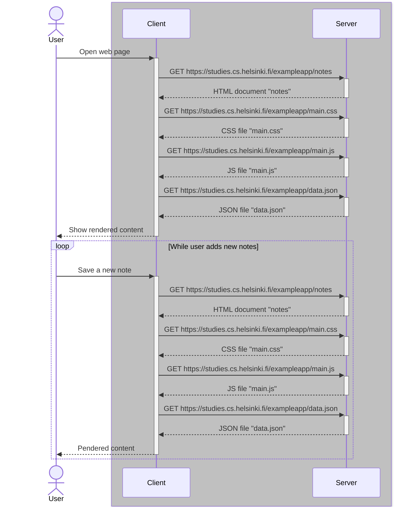
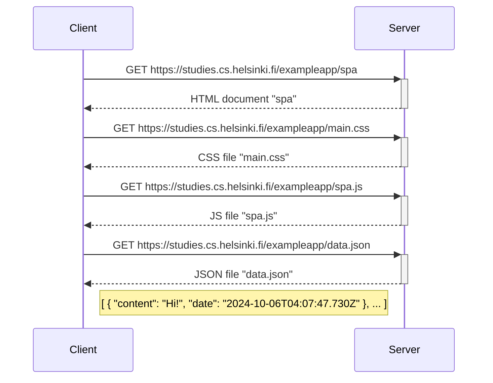
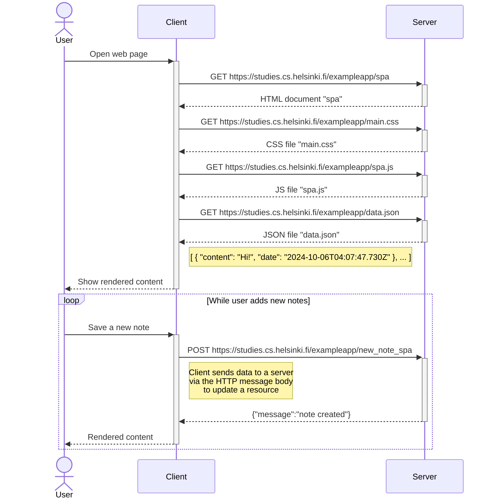

## Part 0: Fundamentals of Web apps

The [part 0](https://fullstackopen.com/en/part0/fundamentals_of_web_apps) explores the basic concepts of web development:

- Defining simple web page structures with HTML
- Creating forms for user interaction
- Styling web content with CSS
- Understanding browser-server communication via HTTP requests (GET/POST)
- Visualizing system interactions through diagrams

### Exercises
**0.4: New note diagram**  

Create a sequence diagram of the situation where the user creates a new note on the page ["notes"](https://studies.cs.helsinki.fi/exampleapp/notes) by writing something into the text field and clicking the `Save` button.

**Solution:**  

  

**0.5: Single page app diagram**  

Create a sequence diagram of the situation where the user goes to [the single-page app version of the notes app](https://studies.cs.helsinki.fi/exampleapp/spa).

**Solution:**   

  

**0.6: New note in Single page app diagram**   

Create a diagram showing the situation where the user creates a new note using [the single-page version of the app](https://studies.cs.helsinki.fi/exampleapp/spa).

**Solution:** 

#### Additional materials:
- [Sequence Diagrams](https://www.geeksforgeeks.org/unified-modeling-language-uml-sequence-diagrams/)
- [Mermaid-syntax for GitHub Markdown-files](https://docs.github.com/en/get-started/writing-on-github/working-with-advanced-formatting/creating-diagrams)
- [HTML tutorial](https://developer.mozilla.org/en-US/docs/Learn/Getting_started_with_the_web/HTML_basics)
- [CSS tutorial](https://developer.mozilla.org/en-US/docs/Learn/Getting_started_with_the_web/CSS_basics)
- [HTML forms](https://developer.mozilla.org/en-US/docs/Learn/Forms/Your_first_form)

____
Made by Julia Persidskaia.  
[LinkedIn](https://www.linkedin.com/in/iuliia-persidskaia/)